# IPKproject1

## Table of Contents

- [Executive Summary](#executive-summary)
- [Execution](#execution)
    - [Parameters](#parameters)
    - [Execution Examples](#execution-examples)
- [Repository Structure](#repository-structure)
- [UML Diagram](#uml-diagram)
    - [Design Philosophy](#design-philosophy)
- [Testing](#testing)
    - [Argument Parsing](#argument-parsing)
    - [Listing Available Interfaces](#listing-available-interfaces)
    - [Invalid Input Testing](#invalid-input-testing)
        - [Invalid Domain Name](#invalid-domain-name)
        - [Invalid IP Address](#invalid-ip-address)
    - [Port Scanning](#port-scanning)
        - [TCP IPv4](#tcp-ipv4)
        - [TCP IPv6](#tcp-ipv6)
        - [UDP IPv4](#udp-ipv4)
        - [UDP IPv6](#udp-ipv6)
    - [Testing Summary](#testing-summary)
- [Bibliography](#bibliography)

## Executive Summary

This project implements a TCP/UDP port scanner using IPv4 and IPv6 in C++. The scanner operates as follows:

- **TCP Scanning**: A SYN packet is sent to the target port. Based on the response:
    - **SYN-ACK**: The port is open.
    - **RST**: The port is closed.
    - **No response (after two attempts)**: The port is filtered.
    - Note: The scanner avoids completing the full three-way handshake, minimizing interaction with the target.

- **UDP Scanning**: A port is considered:
    - **Closed**: If an ICMP response of type 3 (Destination Unreachable) is received.
    - **Open**: Otherwise, due to the lack of explicit feedback in UDP.

### Underlying Technology

- **TCP**: A connection-oriented protocol ensuring reliable communication. The SYN-ACK handshake is leveraged to determine port states.
- **UDP**: A connectionless protocol with minimal overhead, making it harder to confirm port status without explicit ICMP feedback.
- **IPv4/IPv6**: Both protocols are supported, ensuring compatibility with modern and legacy networks.

This project demonstrates practical applications of network protocols and packet-level communication.

## Execution

The scanner requires elevated privileges to run and must be executed with `sudo`. Use the following syntax to launch the scanner:

```bash
./ipk-l4-scan {-h | --help} [-i interface | --interface interface] [-t port-ranges | --pt port-ranges] [-u port-ranges | --pu port-ranges] [-w timeout | --wait timeout] [hostname | ip-address]
```

### Parameters

- **`-h, --help`**: Displays usage instructions and exits.
- **`-i, --interface`**: Specifies the network interface to use (e.g., `eth0`). If omitted or specified without a value, a list of active interfaces is displayed.
- **`-t, --pt`**: Specifies TCP ports to scan. Accepts single ports (e.g., `22`), ranges (e.g., `1-65535`), or comma-separated values (e.g., `22,23,24`).
- **`-u, --pu`**: Specifies UDP ports to scan. Accepts the same formats as TCP ports.
- **`-w, --wait`**: Sets the timeout in milliseconds for a single port scan. Defaults to `5000` ms if not specified.
- **`hostname | ip-address`**: The target to scan, which can be a domain name (e.g., `example.com`) or an IPv4/IPv6 address.

### Execution Examples

1. **Scan UDP ports 53 and 67 on an IPv6 address using `eth0`**:
        ```bash
        ./ipk-l4-scan --interface eth0 -u 53,67 2001:67c:1220:809::93e5:917
        ```

2. **Scan TCP ports 80, 443, and 8080 on a domain with a 1-second timeout**:
        ```bash
        ./ipk-l4-scan -i eth0 -w 1000 -t 80,443,8080 www.vutbr.cz
        ```

3. **Display active network interfaces**:
        ```bash
        ./ipk-l4-scan -i
        ```

4. **Display help message**:
        ```bash
        ./ipk-l4-scan --help
        ```

## Repository Structure

The repository is organized as follows:

- **`src/`**: Contains the source code of the project.
- **`include/`**: Includes header files or additional resources required for the project.
- **`Makefile`**: Used for building the project.

## UML Diagram

Below is a high-level diagram of the system architecture:

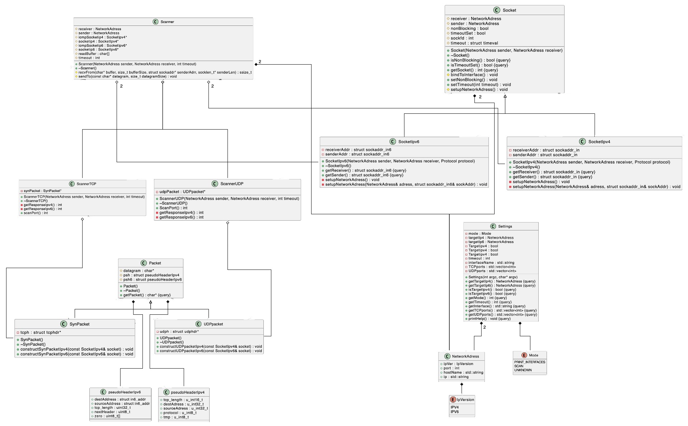

### Design Philosophy

The program adopts an object-oriented programming (OOP) approach to enhance modularity and reduce code repetition. By encapsulating repetitive code into reusable classes, the design improves readability, maintainability, and aligns with modern software development practices.

## Testing

All testing was conducted either on the vut FIT server Merlin, my local arm64 ubuntu vm or my fedora amd64 workstation.

### Argument Parsing

The `settings` object was tested to ensure correct argument parsing. A shell script was used to compile the project with a special main function that prints parsed arguments. The script then ran the binary with multiple inputs to verify correctness. Below is an example of the output:

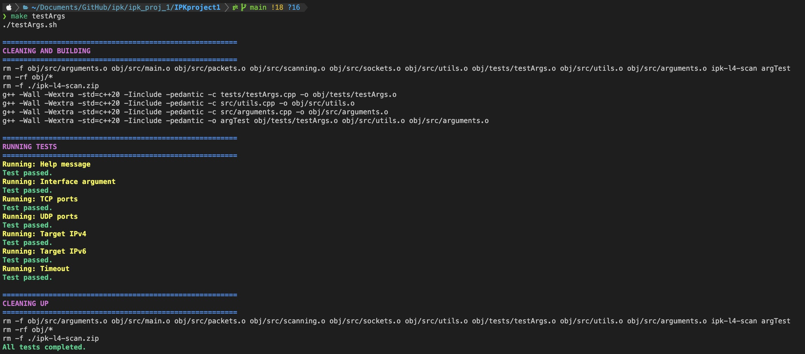

### Listing Available Interfaces

The program's output for available network interfaces was compared with Wireshark's interface list. The comparison confirmed that the program accurately identifies and lists the same interfaces:

- **Program Output**:  
    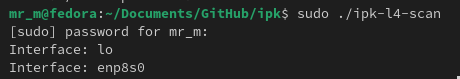  
- **Wireshark Output**:  
    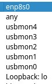

### Invalid Input Testing

#### Invalid Domain Name

The program correctly identified invalid domain names and displayed appropriate error messages. This behavior was validated by attempting to ping the same domain:

- **Program Output**:  
    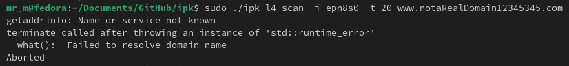  
- **Ping Output**:  
    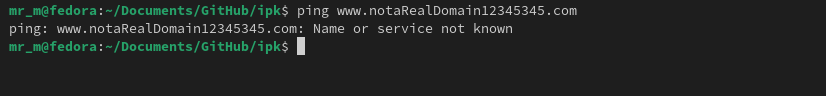

#### Invalid IP Address

The program also handled invalid IP addresses gracefully:

- **Program Output**:  
    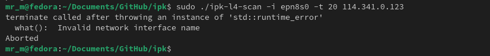  
- **Ping Output**:  
    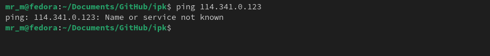

### Port Scanning

#### TCP IPv4

- **Program Output**:  
    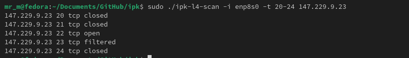  
- **Wireshark Output**:  
    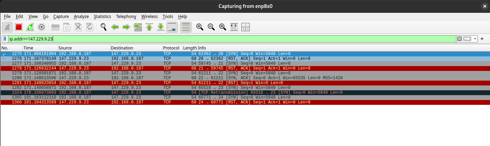

#### TCP IPv6

- **Program Output**:  
    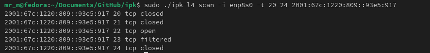  
- **Wireshark Output**:  
    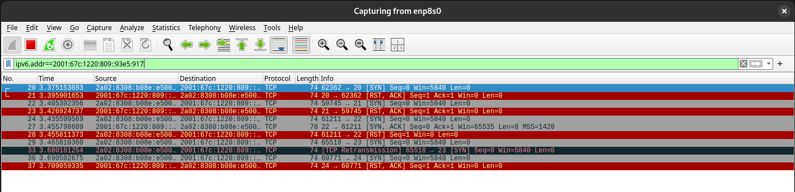

#### UDP IPv4

- **Program Output**:  
    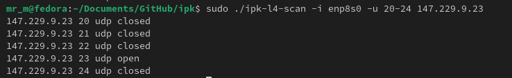  
- **Wireshark Output**:  
    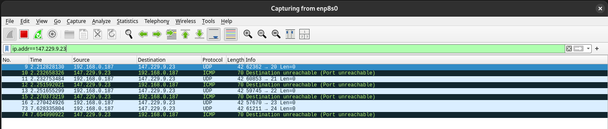

#### UDP IPv6

- **Program Output**:  
    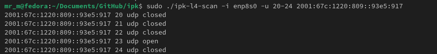  
- **Wireshark Output**:  
    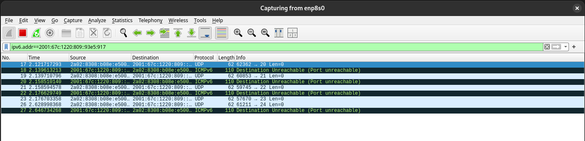

### Testing Summary

All tests were run multiple times to ensure consistent results. Combined tests verified the program's stability under comprehensive conditions:

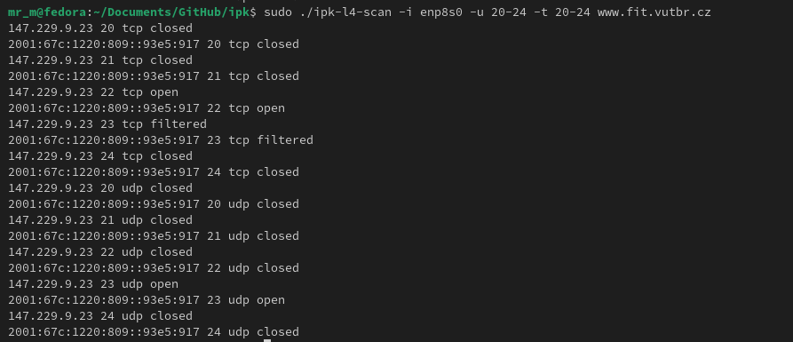

## Bibliography

SCRIBLES.NET, 2024. Generating UML Class Diagram from C++ Header File using PlantUML. Online. Available from:  
https://scribles.net/generating-uml-class-diagram-from-c-header-file-using-plantuml/  
[Accessed 10 March 2025].  

DASCANDY, 2018. Example of a raw socket program in C. Online. Available from:  
https://gist.github.com/dascandy/544acdfdc907051bcaa0b51d6d4a334a  
[Accessed 13 March 2025].  

BUCHAN, Paul D., 2024. Raw socket programming in C. Online. Available from:  
https://www.pdbuchan.com/rawsock/rawsock.html  
[Accessed 11 March 2025].  

LINUX TIPS, 2022. Create SYN flood with raw socket in C. Online. Available from:  
https://linuxtips.ca/index.php/2022/05/06/create-syn-flood-with-raw-socket-in-c/  
[Accessed 15 March 2025].  

MAXXOR, 2017. Raw sockets example in C. Online. Available from:  
https://github.com/MaxXor/raw-sockets-example/blob/master/rawsockets.c  
[Accessed 9 March 2025].  

ORYX EMBEDDED, 2025. Raw socket example in C. Online. Available from:  
https://www.oryx-embedded.com/doc/raw__socket_8c_source.html  
[Accessed 16 March 2025].  

