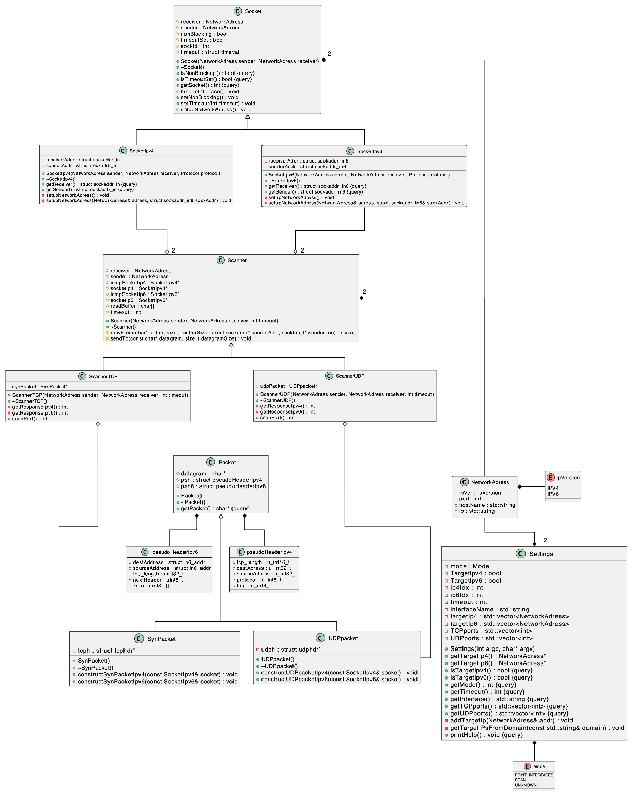

# IPKproject1

## Table of Contents

- [Executive Summary](#executive-summary)
- [Execution](#execution)
    - [Parameters](#parameters)
    - [Execution Examples](#execution-examples)
- [Repository Structure](#repository-structure)
- [UML Diagram](#uml-diagram)
    - [Design Philosophy](#design-philosophy)
- [Testing](#testing)
    - [Argument Parsing](#argument-parsing)
    - [Listing Available Interfaces](#listing-available-interfaces)
    - [Invalid Input Testing](#invalid-input-testing)
        - [Invalid Domain Name](#invalid-domain-name)
        - [Invalid IP Address](#invalid-ip-address)
    - [Port Scanning](#port-scanning)
        - [TCP testing methodology](#tcp-testing-methodology)
            - [TCP IPv4](#tcp-ipv4)
            - [TCP IPv6](#tcp-ipv6)
            - [TCP Testing Conclusion](#conclusion-of-testing-tcp)
        - [UDP testing methodology](#udp-testing-methodology)
            - [UDP IPv4](#udp-ipv4)
            - [UDP IPv6](#udp-ipv6)
            - [UDP Testing Conclusion](#conclusion-of-testing-udp)
    - [Testing Summary](#testing-summary)
- [Bibliography](#bibliography)

## Executive Summary

This project implements a TCP/UDP port scanner using IPv4 and IPv6 in C++. The scanner operates as follows:

- **TCP Scanning**: A SYN packet is sent to the target port. Based on the response:
    - **SYN-ACK**: The port is open.
    - **RST**: The port is closed.
    - **No response (after two attempts)**: The port is filtered.
    - Note: The scanner avoids completing the full three-way handshake, minimizing interaction with the target.

- **UDP Scanning**: A port is considered:
    - **Closed**: If an ICMP response of type 3 (Destination Unreachable) is received.
    - **Open**: Otherwise, due to the lack of explicit feedback in UDP.

### Underlying Technology

- **TCP**: A connection-oriented protocol ensuring reliable communication. The SYN-ACK handshake is leveraged to determine port states.
- **UDP**: A connectionless protocol with minimal overhead, making it harder to confirm port status without explicit ICMP feedback.
- **IPv4/IPv6**: Both protocols are supported, ensuring compatibility with modern and legacy networks.

This project demonstrates practical applications of network protocols and packet-level communication.

## Execution

The scanner requires elevated privileges to run and must be executed with `sudo`. Use the following syntax to launch the scanner:

```bash
./ipk-l4-scan {-h | --help} [-i interface | --interface interface] [-t port-ranges | --pt port-ranges] [-u port-ranges | --pu port-ranges] [-w timeout | --wait timeout] [hostname | ip-address]
```

### Parameters

- **`-h, --help`**: Displays usage instructions and exits.
- **`-i, --interface`**: Specifies the network interface to use (e.g., `eth0`). If omitted or specified without a value, a list of active interfaces is displayed.
- **`-t, --pt`**: Specifies TCP ports to scan. Accepts single ports (e.g., `22`), ranges (e.g., `1-65535`), or comma-separated values (e.g., `22,23,24`).
- **`-u, --pu`**: Specifies UDP ports to scan. Accepts the same formats as TCP ports.
- **`-w, --wait`**: Sets the timeout in milliseconds for a single port scan. Defaults to `5000` ms if not specified.
- **`hostname | ip-address`**: The target to scan, which can be a domain name (e.g., `example.com`) or an IPv4/IPv6 address.

### Execution Examples

1. **Scan UDP ports 53 and 67 on an IPv6 address using `eth0`**:
        ```bash
        ./ipk-l4-scan --interface eth0 -u 53,67 2001:67c:1220:809::93e5:917
        ```

2. **Scan TCP ports 80, 443, and 8080 on a domain with a 1-second timeout**:
        ```bash
        ./ipk-l4-scan -i eth0 -w 1000 -t 80,443,8080 www.vutbr.cz
        ```

3. **Display active network interfaces**:
        ```bash
        ./ipk-l4-scan -i
        ```

4. **Display help message**:
        ```bash
        ./ipk-l4-scan --help
        ```

## Repository Structure

The repository is organized as follows:

- **`src/`**: Contains the source code of the project.
- **`include/`**: Includes header files or additional resources required for the project.
- **`Makefile`**: Used for building the project.

## UML Diagram

Below is a high-level diagram of the system architecture:



### Design Philosophy

The program adopts an object-oriented programming (OOP) approach to enhance modularity and reduce code repetition. By encapsulating repetitive code into reusable classes, the design improves readability, maintainability, and aligns with modern software development practices. 

According to Heuschkel et al. [1], the use of RAW sockets necessitates root access due to the critical nature of networking headers. This approach also allowed me to bypass the construction of IP headers, as detailed in the referenced document. Instead, I focused solely on constructing TCP/UDP headers. However, to ensure the correct checksum calculation, a pseudo-header was implemented. For further implementation details, please refer to the files `packets.cpp` and `packets.hpp`.

## Testing

### Testing Environment

The testing process was conducted on three distinct systems to ensure comprehensive validation:

1. **Fedora Workstation**: A physical machine operating on Fedora.
2. **Ubuntu Virtual Machine**: A virtual machine provided as part of the project, running on VirtualBox.
3. **UTM Virtual Machine**: A virtual machine managed through UTM, an open-source application designed for virtual machine management on M-series MacBooks.

### Testing Methodology

The testing methodology involved executing the program and analyzing network traffic captured using Wireshark. The program's behavior was evaluated against the expected outcomes as detailed in the [Executive Summary](#executive-summary). This comparison ensured that the program's output accurately reflected the observed network traffic for both TCP and UDP scanning across IPv4 and IPv6 protocols.

### Argument Parsing

The `settings` class was tested to ensure correct argument parsing. A shell script was used to compile the project with a special main function that prints parsed arguments. The script then ran the binary with multiple inputs to verify correctness. Below is an example of the output:


### Listing Available Interfaces

The program's output for available network interfaces was compared with Wireshark's interface list. The comparison confirmed that the program accurately identifies and lists the same interfaces:

- **Program Output**:  
      
- **Wireshark Output**:  
    

### Invalid Input Testing
#### Invalid Domain Name

The program correctly identified invalid domain names and displayed appropriate error messages. This behavior was validated by attempting to ping the same domain:

- **Program Output**:  
      
- **Ping Output**:  
    

#### Invalid IP Address

The program also handled invalid IP addresses gracefully:

- **Program Output**:  
      
- **Ping Output**:  
    

### Port Scanning

#### TCP Testing Methodology

For TCP testing, the application was executed with an IPv4 address and a port range of 20-24. During the scan, Wireshark was used to capture network traffic on the specified address. After the scan completed, the captured traffic was analyzed to verify the program's behavior.

The verification process involved matching the program's output with the observed traffic in Wireshark. Specifically:

- If a SYN packet was sent and a SYN-ACK response was received, the port was marked as **open**.
- If a SYN packet was sent and an RST response was received, the port was marked as **closed**.
- If no response was received after the first SYN packet, a second SYN packet was sent. If no response was received again, the port was marked as **filtered**.

This approach ensured that the program's results accurately reflected the observed network behavior.

##### TCP IPv4

- **Program Output**:  
      
- **Wireshark Output**:  
    

##### TCP IPv6

- **Program Output**:  
      
- **Wireshark Output**:  
    

##### Conclusion of testing TCP

The program's behavior for TCP in both IPv4 and IPv6 was validated through rigorous testing. For IPv4, the program correctly identified open, closed, and filtered ports by analyzing SYN-ACK, RST, and lack of responses, respectively. This was confirmed by comparing the program's output with Wireshark's captured traffic, which showed matching results. Similarly, for IPv6, the program demonstrated consistent behavior, accurately reflecting the state of the scanned ports. The alignment between the program's output and Wireshark's observations confirms the correctness of the implementation for TCP in both IPv4 and IPv6.

#### UDP Testing Methodology

For UDP testing, the program was executed with both IPv4 and IPv6 targets, scanning ports 20-24. The testing adhered to the specified behavior: if an ICMP Type 3 (Destination Unreachable) message was received, the port was marked as **closed**; otherwise, it was marked as **open**. During the scans, network traffic was captured using Wireshark to validate the program's output against observed network behavior.

##### UDP IPv4

- **Program Output**:  
      
- **Wireshark Output**:  
    

##### UDP IPv6

- **Program Output**:  
      
- **Wireshark Output**:  
    

##### Conclusion of testing UDP
The Wireshark logs align closely with the program's output, accurately marking each port as open or closed based on the presence or absence of ICMP messages. Specifically, when an ICMP Type 3 (Destination Unreachable) message was received, the program correctly identified the port as closed. Conversely, in the absence of such messages, the port was marked as open. This consistency between the program's results and Wireshark's captured traffic validates the correctness of the UDP scanning implementation.

### Testing Summary

All tests were run multiple times to ensure consistent results. Combined tests verified the program's stability under comprehensive conditions:


As demonstrated in the screenshots above, the program's behavior remains consistent regardless of whether the tests are executed individually or in combination. This consistency underscores the reliability and correctness of the implementation across various scenarios.

## Bibliography

### Technical Reports
- Heuschkel, J., Hofmann, T., Kuepper, J., & Hollstein, T. (2017). *Introduction to RAW-sockets*. Technical Report No. TUD-CS-2017-0111. Darmstadt: Technische Universität Darmstadt. Available at: [https://tuprints.ulb.tu-darmstadt.de/6243/1/TR-18.pdf](https://tuprints.ulb.tu-darmstadt.de/6243/1/TR-18.pdf)

### Online Articles
- Scribles.net. (2024). *Generating UML Class Diagram from C++ Header File using PlantUML*. Available at: [https://scribles.net/generating-uml-class-diagram-from-c-header-file-using-plantuml/](https://scribles.net/generating-uml-class-diagram-from-c-header-file-using-plantuml/)
- Dascandy. (2018). *Example of a raw socket program in C*. Available at: [https://gist.github.com/dascandy/544acdfdc907051bcaa0b51d6d4a334a](https://gist.github.com/dascandy/544acdfdc907051bcaa0b51d6d4a334a)
- Buchan, P. D. (2024). *Raw socket programming in C*. Available at: [https://www.pdbuchan.com/rawsock/rawsock.html](https://www.pdbuchan.com/rawsock/rawsock.html)
- Linux Tips. (2022). *Create SYN flood with raw socket in C*. Available at: [https://linuxtips.ca/index.php/2022/05/06/create-syn-flood-with-raw-socket-in-c/](https://linuxtips.ca/index.php/2022/05/06/create-syn-flood-with-raw-socket-in-c/)
- MaxXor. (2017). *Raw sockets example in C*. Available at: [https://github.com/MaxXor/raw-sockets-example/blob/master/rawsockets.c](https://github.com/MaxXor/raw-sockets-example/blob/master/rawsockets.c)
- Oryx Embedded. (2025). *Raw socket example in C*. Available at: [https://www.oryx-embedded.com/doc/raw__socket_8c_source.html](https://www.oryx-embedded.com/doc/raw__socket_8c_source.html)
- Otta, M. (2023). *What Are Raw Sockets?* Baeldung on Computer Science. Available at: [https://www.baeldung.com/cs/raw-sockets](https://www.baeldung.com/cs/raw-sockets)

### RFC Documents
- Postel, J. (1981). *Transmission Control Protocol*. RFC 793. DOI: [10.17487/RFC793](https://doi.org/10.17487/RFC793). Available at: [https://datatracker.ietf.org/doc/html/rfc793](https://datatracker.ietf.org/doc/html/rfc793)
- Postel, J. (1981). *Internet Control Message Protocol*. RFC 792. DOI: [10.17487/RFC792](https://doi.org/10.17487/RFC792). Available at: [https://datatracker.ietf.org/doc/html/rfc792](https://datatracker.ietf.org/doc/html/rfc792)